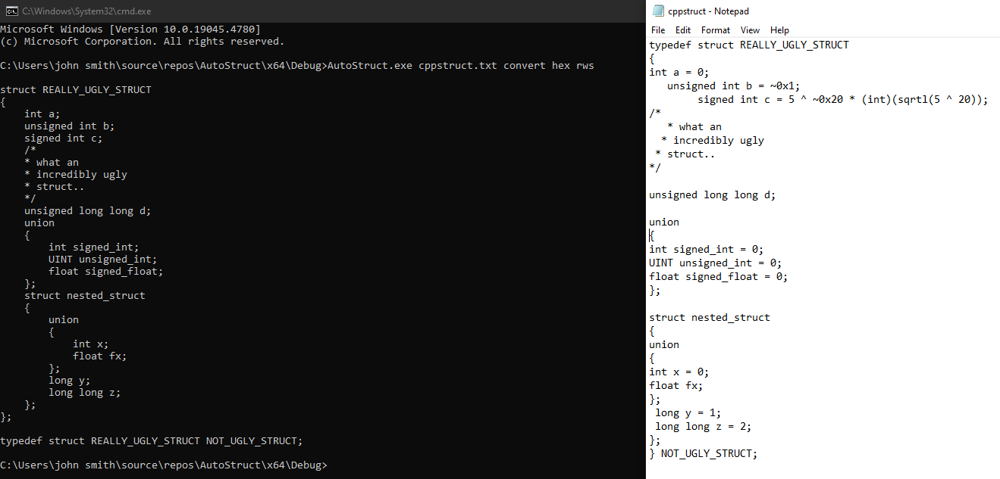
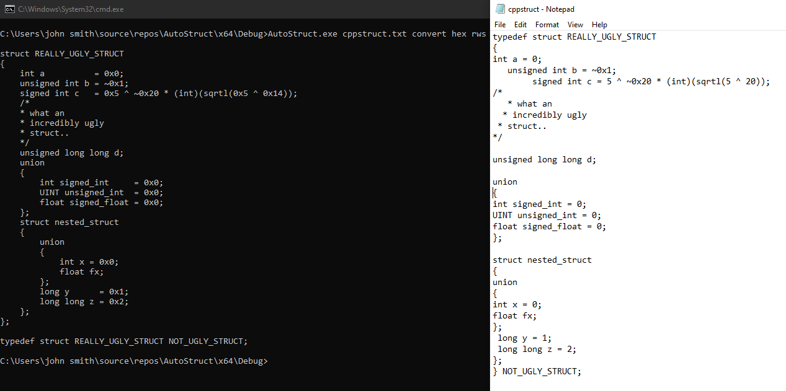
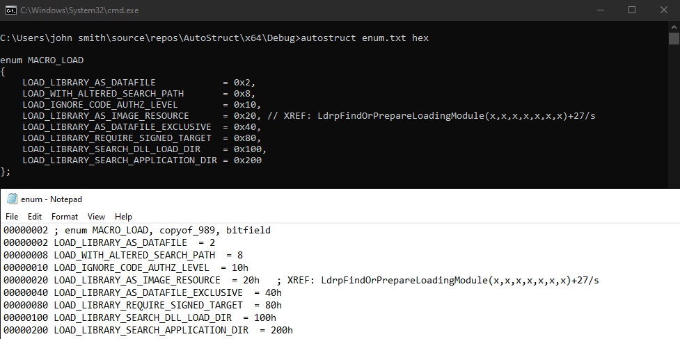
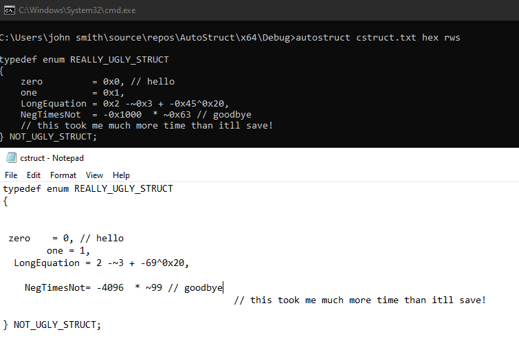

# AutoStruct

Automatic alignment and syntax conversion of IDA/C++ enums and structs.

# Usage

- Argument format: &lt;FilePath&gt; &lt;Flags&gt;
- FilePath must be the path of a file containing the struct/enum that you want to make changes to, with nothing else in the file. This may change in the future to allow the search of a file for an enum/struct.
- The type of structure will automatically be detected, and alignment/conversion will be applied.
- If you do something especially weird like put a multiline comment before a member on the same line, it will probably break.

### Flags (Case-Insensitive)

- "Convert": Formats struct/enum typedefs for IDA, so that they can be inserted into IDA local types all at once.
- "Rws": Removes empty lines (rws = remove whitespace).
- "Hex": Converts all decimal to hexidecimal.

## Screenshots

